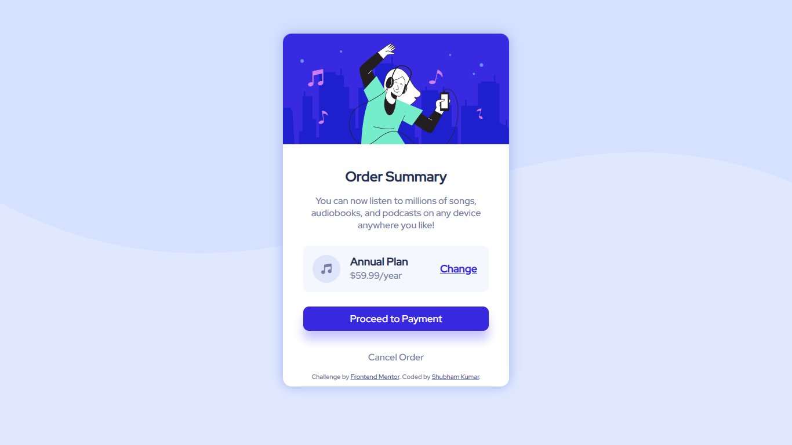

# Frontend Mentor - Order summary card solution

This is a solution to the [Order summary card challenge on Frontend Mentor](https://www.frontendmentor.io/challenges/order-summary-component-QlPmajDUj). Frontend Mentor challenges help you improve your coding skills by building realistic projects. 

## Table of contents

- [Overview](#overview)
  - [The challenge](#the-challenge)
  - [Screenshot](#screenshot)
- [My process](#my-process)
  - [Built with](#built-with)
  - [Continued development](#continued-development)
  - [Useful resources](#useful-resources)
- [Author](#author)

## Overview

### The challenge

Users should be able to:

- See hover states for interactive elements

### Screenshot

## My process

### Built with

- HTML5 markup
- CSS custom properties

### Continued development

I will be focusing on building responsive webpages.

### Useful resources

- [CSS Button Generator](https://css3buttongenerator.com/index.html) - This helped me for making buttons. I really liked this resource and will use it going forward.

## Author
- Shubham Kumar
- Frontend Mentor - [@ShubhamKumar3110](https://www.frontendmentor.io/profile/ShubhamKumar3110)
